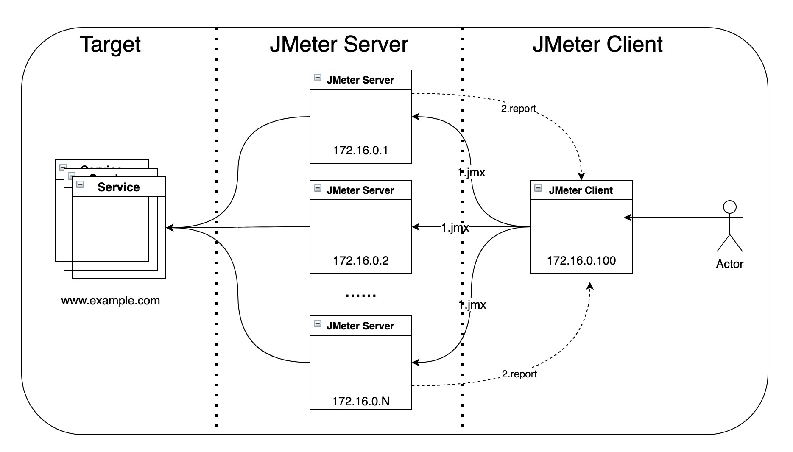

# 基于ECI/ASK部署的JMeter大规模分布式压测
[Apache JMeter](https://jmeter.apache.org/)是一款功能完备的压测工具，通过GUI界面可以方便的编写压测脚本，同时拥有丰富的插件库和成熟社区。
## 为何需要JMeter集群模式
1. 在项目中使用Jmeter进行大并发压测时，单机受限内存、CPU、网络IO，会出现服务器压力还没有上去，但压测服务器由于模拟的压力太大死机的情况。
2. JMeter的集群模式可以让我们将多台机器联合起来一起产生负载，从而弥补单台机器负载生成能力不足的问题。
3. 在云上采用Docker+Serverless的方式可以进一步的降低进行服务压测的门槛，让用户更专注于业务。本文将分别采用Docker、阿里云ECI、阿里云ASK来进行负载测试。

## JMeter分布式压测

1. Client节点：向参与施压的Server节点发送测试脚本，同时接受并聚合Server节点的执行结果，只需部署一台
2. Server节点：接收并执行Client节点发送过来的测试脚本，并将执行结果返回给Client，可根据需要部署多台

## JMeter：使用Docker进行负载测试
下文详细介绍了JMeter使用Docker进行负载测试的步骤，包括：镜像构建、单机压测、集群（分布式）压测。
- [使用Docker进行负载测试](docs/use_docker.md)

## JMeter：使用阿里云ECI进行负载测试
1. 阿里云弹性容器实例（[Elastic Container Instance](https://help.aliyun.com/product/87486.html)）是敏捷安全的Serverless容器运行服务。您无需管理底层服务器，也无需关心运行过程中的容量规划，只需要提供打包好的Docker镜像，即可运行容器，并仅为容器实际运行消耗的资源付费。
2. 结合ecicli命令行工具，可以更加方便的在本地创建云上ECI资源。
3. 下文详细介绍了JMeter使用阿里云ECI进行负载测试的步骤，包括：ecicli的安装、单机压测、集群（分布式）压测，以及如何将压测报告保存在阿里云OSS中。
- [使用ECI进行负载测试](docs/use_eci.md)

## JMeter：使用阿里云ASK进行负载测试
1. ASK是阿里云推出的[Serverless Kubernetes](https://help.aliyun.com/document_detail/86366.html)容器集群，无需购买节点即可直接部署容器应用，无需对集群进行节点维护和容量规划，并且根据应用配置的CPU和内存资源量进行按需付费，因此ASK特别适合这种需要高弹性的计算资源的场景。
2. 下文详细介绍了Jmeter使用阿里云ASK进行负载测试的步骤，包括：ask集群部署被测服务、定时对服务进行集群（分布式）压测、将压测报告保存在阿里云NAS中，以及如何为报告搭建web服务。
- [使用ASK进行负载测试](docs/use_ask.md)

## JMeter：验证ASK集群HPA特性
ASK支持在控制台界面上快速创建支持HPA的应用，实现容器资源的弹性伸缩。您也可通过定义HPA（Horizontal Pod Autoscaling）的YAML来进行配置。
- [验证ASK的自动水平伸缩](docs/jmeter_ask_hpa.md)
