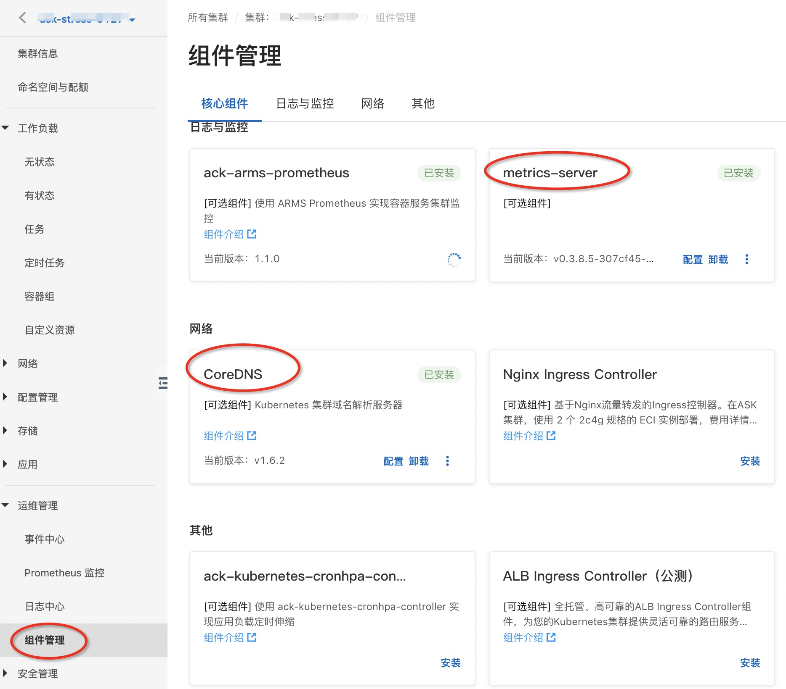
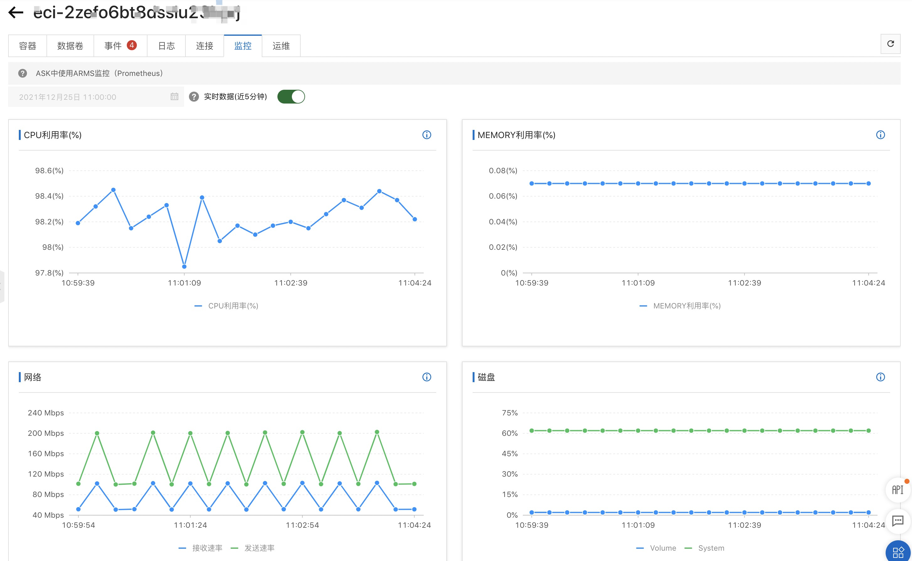

# 验证ASK的自动水平伸缩HPA
ASK兼容标准Kubernetes的HPA特性，本文结合JMeter压测来验证HPA的弹性伸缩特性。

## 准备ASK集群
- 参考[ASK使用快速入门](https://help.aliyun.com/document_detail/186945.html#title-3t9-pbr-pjl)创建ASK集群。
- 在本地安装[kubectl](https://kubernetes.io/zh/docs/tasks/tools/install-kubectl/)，并配置好~/.kube/config，具体操作请参见[通过kubectl工具连接集群](https://help.aliyun.com/document_detail/86494.htm?spm=a2c4g.11186623.0.0.52ba13e7Trfl8b#task-2076136)。
- 在ASK集群中部署CoreDNS、metrics-server
- 
  
## 镜像构建
- 构建镜像
进入到docker目录根据Dockerfile构建镜像，并推送到阿里云ACR中
```sh
➜ cd docker/
➜ docker build -t jmeter:5.4.2 .
➜ docker tag jmeter:5.4.2 registry.cn-beijing.aliyuncs.com/eci_open/jmeter:5.4.2
➜ docker push registry.cn-beijing.aliyuncs.com/eci_open/jmeter:5.4.2
```

## 部署被测服务
1. 部署一个简单的2副本Nginx作为被测服务。
2. 同时创建service，在集群内的访问域名为：nginx.default.svc.cluster.local
3. 创建弹性伸缩规则HPA
```sh
➜ kubectl apply -f ask/deploy/deploy_nginx.yaml
deployment.apps/nginx created
service/nginx created
➜ kubectl apply -f ask/hpa/nginx-hpa.yaml 
horizontalpodautoscaler.autoscaling/nginx-hpa created
➜ kubectl get hpa                               
NAME        REFERENCE          TARGETS   MINPODS   MAXPODS   REPLICAS   AGE
nginx-hpa   Deployment/nginx   0%/40%    1         10        1          13s
```

## 测试脚本
用ask/nginx-svc-hpa-test.jmx创建ConfigMap: test-plan-hpa
```sh
➜ kubectl create configmap test-plan-hpa --from-file=nginx-hpa=ask/nginx-svc-hpa-test.jmx
configmap/test-plan-hpa created
```

## 集群模式（分布式）
- 部署多个JMeter Server作为施压机器
```sh
➜ kubectl apply -f ask/deploy/deploy_jmeter_server.yaml
```
- 待所有JMeter Server启动完毕后，查看每个Pod的IP
```sh
➜ kubectl apply -f ask/deploy/deploy_jmeter_server.yaml
deployment.apps/jmeter-server created
service/jmeter-server-headless created
➜ kubectl get pod -l app=jmeter-server
NAME                            READY   STATUS    RESTARTS   AGE
jmeter-server-cf954f84c-52ctw   1/1     Running   0          68s
jmeter-server-cf954f84c-mhxhj   1/1     Running   0          68s
jmeter-server-cf954f84c-pvj8h   1/1     Running   0          68s
➜ JMETER_LIST=`kubectl get ep jmeter-server-headless -o=jsonpath='{..ip}'|tr ' ', ','`
➜ echo $JMETER_LIST
172.16.4.29,172.16.4.30,172.16.4.31
```
- 提交测试任务
1. 首先要根据实际JMeter Server列表修改 test/oss/cluster_job_oss.yaml 脚本中的远端地址列表，占位地址为：127.0.0.1
2. 通过创建一个Job，执行压测任务
3. 查看压测任务日志
4. 查看HPA执行状态
```sh
➜ JMETER_LIST=`kubectl get ep jmeter-server-headless -o=jsonpath='{..ip}'|tr ' ', ','` && echo $JMETER_LIST
➜ sed "s/127.0.0.1/$JMETER_LIST/g" ask/hpa/cluster_job_hpa.yaml > cluster_job_hpa_r.yaml
➜ kubectl apply -f cluster_job_hpa_r.yaml
job.batch/jmeter-cluster-hpa created
➜ kubectl get pod -l job-name=jmeter-cluster-hpa
NAME                       READY   STATUS    RESTARTS   AGE
jmeter-cluster-hpa-hfht7   1/1     Running   0          97s
➜ kubectl logs jmeter-cluster-hpa-hfht7
Dec 23, 2021 11:13:55 AM java.util.prefs.FileSystemPreferences$1 run
INFO: Created user preferences directory.
Creating summariser <summary>
Created the tree successfully using /data/nginx.jmx
Configuring remote engine: 172.16.4.29
Configuring remote engine: 172.16.4.30
Configuring remote engine: 172.16.4.31
Starting distributed test with remote engines: [172.16.4.29, 172.16.4.30, 172.16.4.31] @ Thu Dec 23 11:13:56 UTC 2021 (1640258036335)
Remote engines have been started:[172.16.4.29, 172.16.4.30, 172.16.4.31]
Waiting for possible Shutdown/StopTestNow/HeapDump/ThreadDump message on port 4445
summary +  17404 in 00:00:03 = 6115.2/s Avg:     1 Min:     0 Max:    20 Err:     0 (0.00%) Active: 30 Started: 30 Finished: 0
summary + 541900 in 00:00:30 = 18054.9/s Avg:     1 Min:     0 Max:    82 Err:     0 (0.00%) Active: 30 Started: 30 Finished: 0
summary = 559304 in 00:00:33 = 17020.8/s Avg:     1 Min:     0 Max:    82 Err:     0 (0.00%)
summary + 606524 in 00:00:29 = 21006.6/s Avg:     1 Min:     0 Max:    55 Err:     0 (0.00%) Active: 0 Started: 30 Finished: 30
summary = 1165828 in 00:01:02 = 18884.7/s Avg:     1 Min:     0 Max:    82 Err:     0 (0.00%)
Tidying up remote @ Thu Dec 23 11:14:58 UTC 2021 (1640258098895)
... end of run
```
- 查看HPA执行情况
  经过一段时间的持续压测，nginx的副本数从1->3，并稳定在3副本。
```sh
➜ kubectl get hpa                                                                        
NAME        REFERENCE          TARGETS   MINPODS   MAXPODS   REPLICAS   AGE
nginx-hpa   Deployment/nginx   90%/40%   1         10        3          10m
➜ kubectl get hpa
NAME        REFERENCE          TARGETS   MINPODS   MAXPODS   REPLICAS   AGE
nginx-hpa   Deployment/nginx   32%/40%   1         10        3          11m
```
在[ECI控制台](https://eci.console.aliyun.com/)也可以看到nginx对应实例的CPU监控信息


## 清理资源
```sh
➜ kubectl delete configmap test-plan-hpa
➜ kubectl delete -f ask/deploy/deploy_nginx.yaml
➜ kubectl delete -f ask/deploy/deploy_jmeter_server.yaml
➜ kubectl delete -f ask/hpa/nginx-hpa.yaml
➜ kubectl delete -f cluster_job_hpa_r.yaml
```
