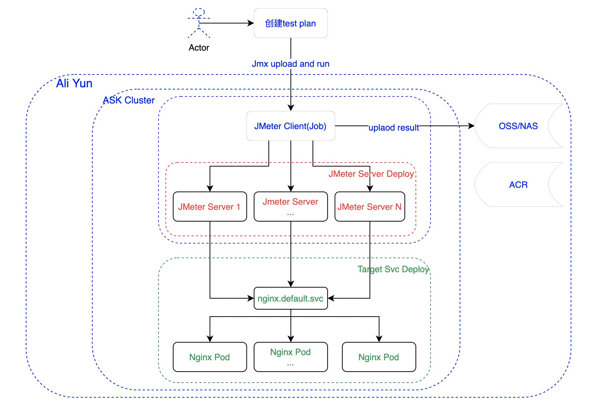
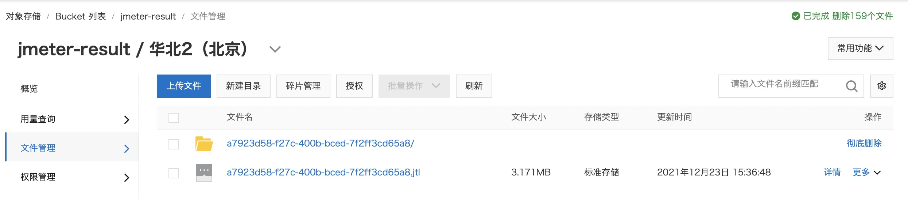
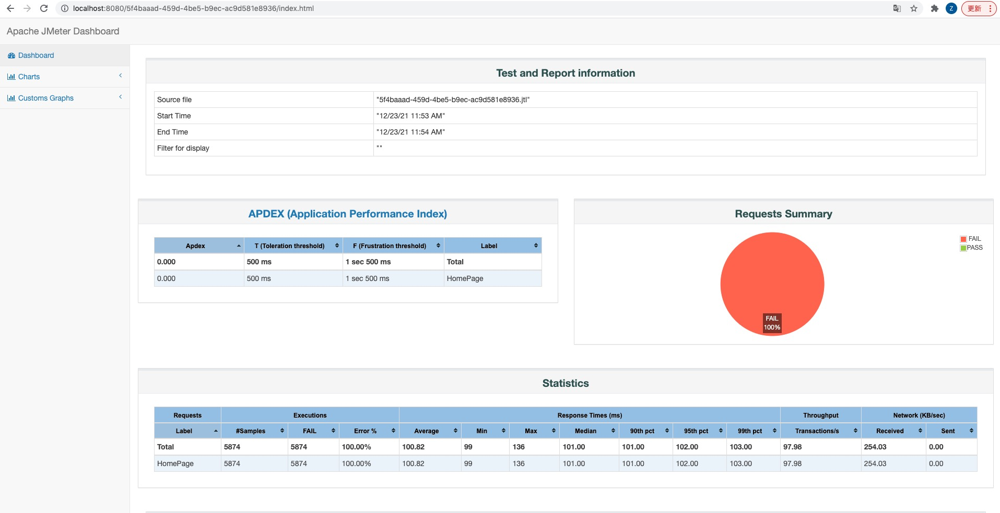

# 采用ASK方式测试
本文介绍如何在阿里云Serverless Kubernetes（ASK）集群中部署JMeter压测服务、采用cronjob的方式对目标服务进行定时压测。

## 架构


## 前提条件
- 开通容器服务ACK，且授权默认角色和开通相关云产品。具体操作，请参见[首次使用容器服务Kubernetes版](https://help.aliyun.com/document_detail/161387.htm)。
- 登录[弹性容器实例](https://eci.console.aliyun.com)控制台，开通ECI服务。
- 开通阿里云OSS，并创建Bucket：jmeter-result，同时创建RamRole(EciOssRoleShare)，详情参考：[挂载OSS（FlexVolume）](https://help.aliyun.com/document_detail/175983.html)
- 开通阿里云NAS，创建文件系统及挂载点，详情参考：[挂载NAS（FlexVolume）](https://help.aliyun.com/document_detail/151406.html)

## 镜像构建
- 构建镜像
进入到docker目录根据Dockerfile构建镜像，并推送到阿里云ACR中
```
➜ cd docker/
➜ docker build -t jmeter:5.4.2 .
➜ docker tag jmeter:5.4.2 registry.cn-beijing.aliyuncs.com/eci_open/jmeter:5.4.2
➜ docker push registry.cn-beijing.aliyuncs.com/eci_open/jmeter:5.4.2
```
## 准备ASK集群
- 参考[ASK使用快速入门](https://help.aliyun.com/document_detail/186945.html#title-3t9-pbr-pjl)创建ASK集群。
- 在ASK集群中部署CoreDNS。
- 在本地安装[kubectl](https://kubernetes.io/zh/docs/tasks/tools/install-kubectl/)，并配置好~/.kube/config，具体操作请参见[通过kubectl工具连接集群](https://help.aliyun.com/document_detail/86494.htm?spm=a2c4g.11186623.0.0.52ba13e7Trfl8b#task-2076136)。

## 部署被测服务
部署一个简单的2副本Nginx作为被测服务。
同时创建service，在集群内的访问域名为：nginx.default.svc.cluster.local
```
➜ kubectl apply -f ask/deploy/deploy_nginx.yaml
```

## 测试脚本
用ask/nginx-svc-test.jmx创建ConfigMap: test-plan
```
➜ kubectl create configmap test-plan --from-file=nginx=ask/nginx-svc-test.jmx
configmap/test-plan created
```

## 单机模式
1. 通过创建一个Job，执行压测任务，并将测试结果上传到OSS中。
2. 查看Pod日志

```sh
➜ kubectl apply -f ask/oss/standalone_job_oss.yaml
➜ kubectl logs jmeter-standalone-oss-9pxnm        
Dec 23, 2021 7:35:45 AM java.util.prefs.FileSystemPreferences$1 run
INFO: Created user preferences directory.
Creating summariser <summary>
Created the tree successfully using /data/nginx.jmx
Starting standalone test @ Thu Dec 23 07:35:46 UTC 2021 (1640244946294)
Waiting for possible Shutdown/StopTestNow/HeapDump/ThreadDump message on port 4445
summary +   1145 in 00:00:13 =   85.9/s Avg:   101 Min:    99 Max:   130 Err:  1145 (100.00%) Active: 10 Started: 10 Finished: 0
summary +   2950 in 00:00:30 =   98.5/s Avg:   100 Min:    99 Max:   133 Err:  2950 (100.00%) Active: 10 Started: 10 Finished: 0
summary =   4095 in 00:00:43 =   94.6/s Avg:   100 Min:    99 Max:   133 Err:  4095 (100.00%)
summary +   1769 in 00:00:18 =   98.3/s Avg:   100 Min:    99 Max:   106 Err:  1769 (100.00%) Active: 0 Started: 10 Finished: 10
summary =   5864 in 00:01:01 =   95.7/s Avg:   100 Min:    99 Max:   133 Err:  5864 (100.00%)
Tidying up ...    @ Thu Dec 23 07:36:48 UTC 2021 (1640245008025)
... end of run
```
3. 等待Pod执行结束Completed，可以到OSS bucket中查看测试结果。


## 集群模式（分布式）
- 部署多个JMeter Server作为施压机器
```sh
➜ kubectl apply -f ask/deploy/deploy_jmeter_server.yaml
```
- 待所有JMeter Server启动完毕后，查看每个Pod的IP
```sh
➜ kubectl apply -f ask/deploy/deploy_jmeter_server.yaml
deployment.apps/jmeter-server created
service/jmeter-server-headless created
➜ kubectl get pod -l app=jmeter-server        
NAME                            READY   STATUS    RESTARTS   AGE
jmeter-server-cf954f84c-52ctw   1/1     Running   0          68s
jmeter-server-cf954f84c-mhxhj   1/1     Running   0          68s
jmeter-server-cf954f84c-pvj8h   1/1     Running   0          68s
➜ JMETER_LIST=`kubectl get ep jmeter-server-headless -o=jsonpath='{..ip}'|tr ' ', ','`
➜ echo $JMETER_LIST
172.16.4.23,172.16.4.24,172.16.4.25
```
- 提交测试任务
1. 首先要根据实际JMeter Server列表修改 test/oss/cluster_job_oss.yaml 脚本中的远端地址列表，占位地址为：127.0.0.1
2. 通过创建一个Job，执行压测任务，并将测试结果上传到OSS中。
3. 查看压测Job日志
4. 等待Job执行结束Completed，可以到OSS bucket中查看测试结果。
```sh
➜ JMETER_LIST=`kubectl get ep jmeter-server-headless -o=jsonpath='{..ip}'|tr ' ', ','`
➜ sed "s/127.0.0.1/$JMETER_LIST/g" ask/oss/cluster_job_oss.yaml > cluster_job_oss_r.yaml
➜ kubectl apply -f cluster_job_oss_r.yaml
job.batch/jmeter-cluster-oss created
➜ kubectl get pod -l job-name=jmeter-cluster-oss
NAME                       READY   STATUS    RESTARTS   AGE
jmeter-cluster-oss-hfht7   1/1     Running   0          97s
➜ kubectl logs jmeter-cluster-oss-hfht7
Dec 23, 2021 11:13:55 AM java.util.prefs.FileSystemPreferences$1 run
INFO: Created user preferences directory.
Creating summariser <summary>
Created the tree successfully using /data/nginx.jmx
Configuring remote engine: 172.16.4.29
Configuring remote engine: 172.16.4.30
Configuring remote engine: 172.16.4.31
Starting distributed test with remote engines: [172.16.4.29, 172.16.4.30, 172.16.4.31] @ Thu Dec 23 11:13:56 UTC 2021 (1640258036335)
Remote engines have been started:[172.16.4.29, 172.16.4.30, 172.16.4.31]
Waiting for possible Shutdown/StopTestNow/HeapDump/ThreadDump message on port 4445
summary +  17404 in 00:00:03 = 6115.2/s Avg:     1 Min:     0 Max:    20 Err:     0 (0.00%) Active: 30 Started: 30 Finished: 0
summary + 541900 in 00:00:30 = 18054.9/s Avg:     1 Min:     0 Max:    82 Err:     0 (0.00%) Active: 30 Started: 30 Finished: 0
summary = 559304 in 00:00:33 = 17020.8/s Avg:     1 Min:     0 Max:    82 Err:     0 (0.00%)
summary + 606524 in 00:00:29 = 21006.6/s Avg:     1 Min:     0 Max:    55 Err:     0 (0.00%) Active: 0 Started: 30 Finished: 30
summary = 1165828 in 00:01:02 = 18884.7/s Avg:     1 Min:     0 Max:    82 Err:     0 (0.00%)
Tidying up remote @ Thu Dec 23 11:14:58 UTC 2021 (1640258098895)
... end of run
```

## 压测结果Web服务
- 在ASK环境下，选择将压测结果保存在OSS里面，可以部署web服务方便浏览
```sh
➜ kubectl apply -f ask/oss/result-web.yaml
pod/result-web created
➜ kubectl port-forward result-web 8080:80
Forwarding from 127.0.0.1:8080 -> 80
Forwarding from [::1]:8080 -> 80
```
- 打开浏览器
保存的测试结果是以pod.metadata.uid作为目录，因此可以采用如下方式访问
```sh
➜ for uid in `kubectl get pod -l app=client -o=jsonpath={..metadata.uid}`; do open "http://localhost:8080/$uid/"; done
```

## 清理资源
```sh
➜ kubectl delete configmap test-plan
➜ kubectl delete -f ask/deploy/deploy_nginx.yaml
➜ kubectl delete -f ask/deploy/deploy_jmeter_server.yaml
➜ kubectl delete -f ask/oss/standalone_job_oss.yaml
➜ kubectl delete -f cluster_job_oss_r.yaml
➜ kubectl delete -f ask/oss/result-web.yaml
```

## 保存在NAS
上面介绍了将测试结果保存在阿里云OSS中的一般步骤，采用阿里云NAS的实验方式类似，只是把存储卷更换成NAS即可，对应的脚本请参考 ask/nas/*.yaml，感兴趣的同学可以动手实验一下。
- 需要将server地址替换为真实地址。