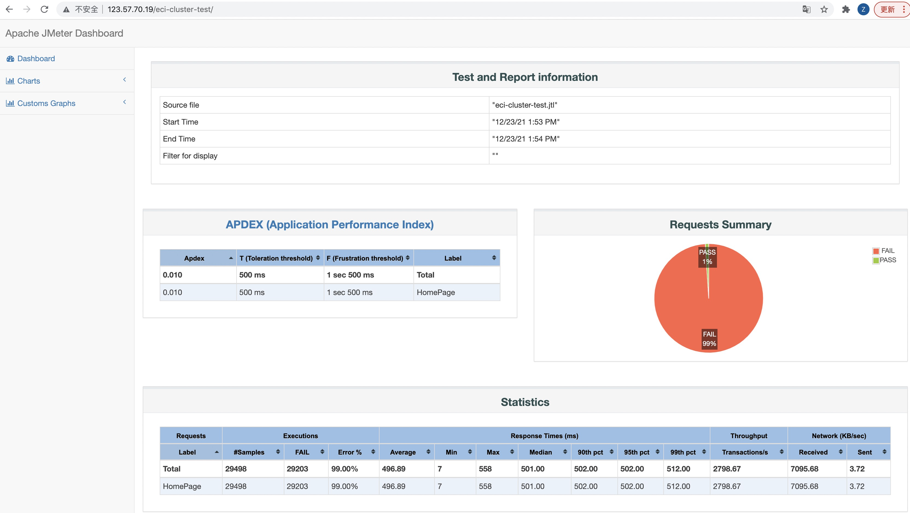

# 采用ECI方式测试
如果没有K8S的使用经验，或者不希望维护K8S集群，那么ECI将是一种更简便的方式，不需要创建ASK这样的云产品。

## 前提条件
- 登录[弹性容器实例](https://eci.console.aliyun.com)控制台，开通ECI服务。
- 开通阿里云OSS，并创建Bucket：jmeter，同时创建RamRole(EciOssRoleShare)，详情参考：[挂载OSS（FlexVolume）](https://help.aliyun.com/document_detail/175983.html)
- 安装ecicli，详情参考：[CLI 快速开始](https://help.aliyun.com/document_detail/186961.html)
  
## 镜像构建
- 构建镜像
进入到docker目录根据Dockerfile构建镜像
```
cd docker/
docker build -t jmeter:5.4.2 .
```
## 单机模式
- 将test_plan/eci-test.jmx上传到OSS，bucket jmeter中
- 创建压测实例
```sh
➜  OSS_VOLUME="oss,jmeter-result,oss-cn-beijing-internal.aliyuncs.com,EciOssRoleShare,rw"
➜  CMD="jmeter -n -t /jmeter/test-plan/eci-test.jmx -l /jmeter/eci-test.jtl -e -o eci-test"
➜  eci run -w 10 --name jmeter-standalone-oss \
  -v oss,jmeter-result,oss-cn-beijing-internal.aliyuncs.com,EciOssRoleShare,rw:/jmeter \
  registry-vpc.cn-beijing.aliyuncs.com/eci_open/jmeter:5.4.2  \
  jmeter -n -t /jmeter/test-plan/eci-test.jmx -l /jmeter/eci-test.jtl -e -o eci-test
eci-2zeid7423w1pkqt0rzf9
➜  eci cg list -o simple
CG_ID                      CREATED                     STATUS    NAME                 
eci-2zeid7423w1pkqt0rzf9   2021-12-23T20:59:42+08:00   Succeeded   jmeter-standalone-oss
```
- 查看实例运行日志
```sh
➜ eci cg logs eci-2zeid7423w1pkotznxfn
Dec 23, 2021 12:48:57 PM java.util.prefs.FileSystemPreferences$1 run
INFO: Created user preferences directory.
Creating summariser <summary>
Created the tree successfully using /jmeter/test-plan/eci-test.jmx
Starting standalone test @ Thu Dec 23 12:48:58 UTC 2021 (1640263738004)
Waiting for possible Shutdown/StopTestNow/HeapDump/ThreadDump message on port 4445
summary +      1 in 00:00:03 =    0.3/s Avg:  1129 Min:  1129 Max:  1129 Err:     1 (100.00%) Active: 500 Started: 500 Finished: 0
summary +   4999 in 00:00:10 =  513.0/s Avg:  1010 Min:   999 Max:  1318 Err:  4999 (100.00%) Active: 0 Started: 500 Finished: 500
summary =   5000 in 00:00:13 =  379.5/s Avg:  1010 Min:   999 Max:  1318 Err:  5000 (100.00%)
Tidying up ...    @ Thu Dec 23 12:49:12 UTC 2021 (1640263752100)
... end of run
```

## 集群模式（分布式）
- 创建3个JMeter Server，作为施压机
```sh
➜  eci run --name server1 registry-vpc.cn-beijing.aliyuncs.com/eci_open/jmeter:5.4.2
➜  eci run --name server2 registry-vpc.cn-beijing.aliyuncs.com/eci_open/jmeter:5.4.2
➜  eci run --name server3 registry-vpc.cn-beijing.aliyuncs.com/eci_open/jmeter:5.4.2
➜  eci cg list -o simple                                                            
CG_ID                      CREATED                     STATUS    NAME   
eci-2zeiazwm89yhtrz2f3uc   2021-12-23T21:17:07+08:00   Running   server3
eci-2zefo6bt8dsrt64xks0c   2021-12-23T21:17:03+08:00   Running   server2
eci-2zecrxmeqc9njvno822x   2021-12-23T21:16:57+08:00   Running   server1
```

- 获取JMeter Server列表(IP)
```sh
➜  for i in 1 2 3; do eci cg describe -n server$i | jq '.ContainerGroups[].IntranetIp'; done;
"172.16.4.51"
"172.16.4.52"
"172.16.4.53"
```
  
- 执行如下命令将压测任务分发到上面的jMeter Server中
```sh
➜  eci run -w 10 --name jmeter-client-oss \
  -v oss,jmeter-result,oss-cn-beijing-internal.aliyuncs.com,EciOssRoleShare,rw:/jmeter \
  registry-vpc.cn-beijing.aliyuncs.com/eci_open/jmeter:5.4.2  \
  jmeter -n -t /jmeter/test-plan/eci-test.jmx -l /jmeter/eci-cluster-test.jtl -e -o /jmeter/eci-cluster-test \
  -Jserver.rmi.ssl.disable=true -R 172.16.4.51,172.16.4.52,172.16.4.53

eci-2zeiazwm89yhtvx4n7uo
➜  eci cg logs eci-2zeiazwm89yhtvx4n7uo
Dec 23, 2021 1:53:55 PM java.util.prefs.FileSystemPreferences$1 run
INFO: Created user preferences directory.
Creating summariser <summary>
Created the tree successfully using /jmeter/test-plan/eci-test.jmx
Configuring remote engine: 172.16.4.51
Configuring remote engine: 172.16.4.52
Configuring remote engine: 172.16.4.53
Starting distributed test with remote engines: [172.16.4.51, 172.16.4.52, 172.16.4.53] @ Thu Dec 23 13:53:56 UTC 2021 (1640267636299)
Remote engines have been started:[172.16.4.51, 172.16.4.52, 172.16.4.53]
Waiting for possible Shutdown/StopTestNow/HeapDump/ThreadDump message on port 4445
summary +    304 in 00:00:03 =  106.0/s Avg:   172 Min:     7 Max:   507 Err:   101 (33.22%) Active: 1179 Started: 1179 Finished: 0
summary +  29194 in 00:00:10 = 2925.0/s Avg:   500 Min:     9 Max:   558 Err: 29102 (99.68%) Active: 0 Started: 1500 Finished: 1500
summary =  29498 in 00:00:13 = 2295.4/s Avg:   496 Min:     7 Max:   558 Err: 29203 (99.00%)
Tidying up remote @ Thu Dec 23 13:54:09 UTC 2021 (1640267649993)
... end of run
```
- 查看测试报告
压测结果保存在OSS里面，可以部署web服务方便浏览
```sh
➜  eci run -w 10 --name result-web \
  -v oss,jmeter-result,oss-cn-beijing-internal.aliyuncs.com,EciOssRoleShare,ro:/usr/share/nginx/html \
  registry-vpc.cn-beijing.aliyuncs.com/eci_open/nginx:latest
➜  eci cg describe -n result-web | jq '.ContainerGroups[0].InternetIp'
"123.57.70.*"
➜  open "http://123.57.70.*/eci-cluster-test/"
```


- 清理资源
```sh
➜  eci cg list -o ids | xargs eci cg delete
```